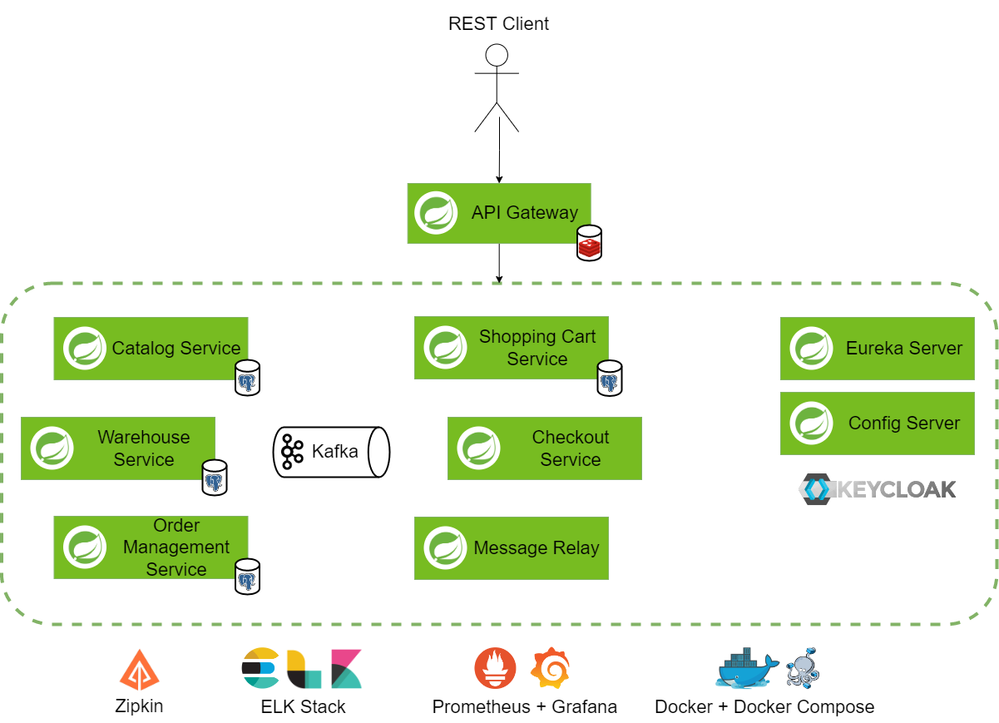
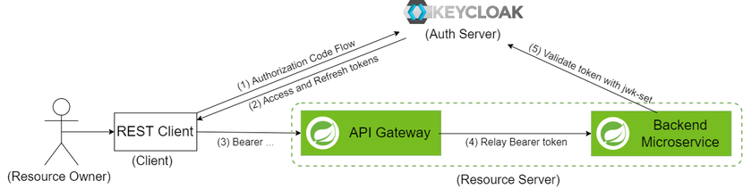
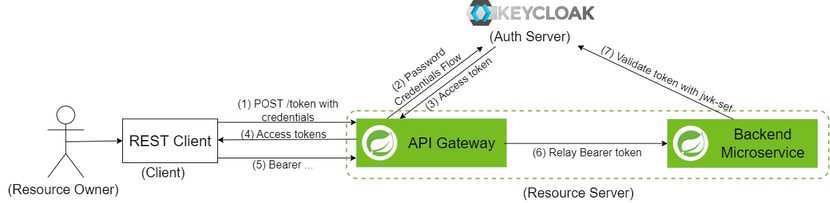
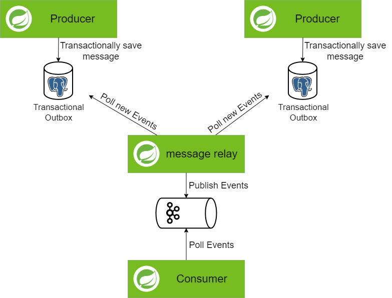
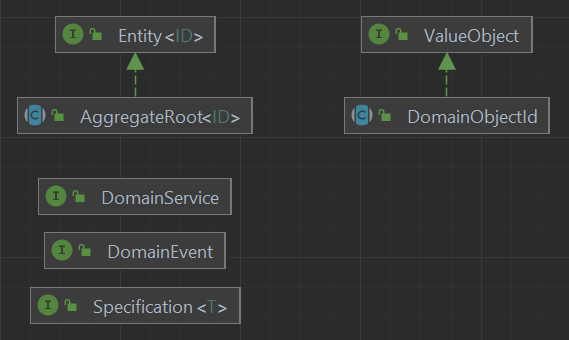
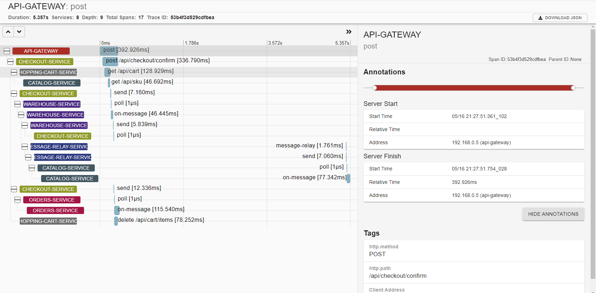

A simple e-shop pet-project build on top of Java 17, Spring Cloud, microservices and DDD.

# Table of Contents

- [Stack](#stack)
- [Getting Started](#getting-started)
- [Project Structure](#project-structure)
- [Architecture](#architecture)
  * [Microservices](#microservices)
    + [API Gateway](#api-gateway)
    + [Service Discovery](#service-discovery)
    + [Externalized Configuration](#externalized-configuration)
  * [Authentication (OAuth2)](#authentication--oauth2-)
  * [IPC (REST + Kafka)](#ipc--rest---kafka-)
    + [REST](#rest)
    + [Messaging](#messaging)
    + [Transactional Messaging](#transactional-messaging)
  * [DDD](#ddd)
- [API](#api)
- [Observability](#observability)
  * [Distributed Tracing (Spring Sleuth + Zipkin)](#distributed-tracing--spring-sleuth---zipkin-)
  * [Logs Aggregation (ELK)](#logs-aggregation--elk-)
  * [Monitoring (Prometheus + Grafana)](#monitoring--prometheus---grafana-)


# Stack

* _Language_: Java 17
* _Frameworks_: 
  * Spring(Boot, MVC, Security, Data, Cloud, Kafka)
  * Hibernate
  * Flyway
  * MapStruct
* _Persistence_: PostgreSQL, Redis
* _Communication_: 
  * _Messaging_: Kafka
  * _REST_: OpenAPI, Swagger UI
* _Authorization_: OAuth2, Keycloak
* _Microservices_:
  * _API Gateway_: Spring Cloud Gateway
  * _Service Discovery_: Eureka
  * _Externalized Config_: Spring Cloud Config, Spring Cloud Bus
* _Observability_:
  * _Distributed Tracing_: Spring Sleuth, Zipkin
  * _Log Aggregation_: Elasticsearch, Logstash, Kibana
  * _Monitoring_: Prometheus, Grafana
* _Tests_: JUnit5, Mockito, JaCoCo, [DbRider](https://github.com/database-rider/database-rider),
  [Testcontainers](https://www.testcontainers.org/)
* _Containerization_: Docker, Docker Compose
* _CI_: Github Actions, SonarCloud


# Getting Started

You can run the entire application by running single script ```./init-and-run.sh```.
It will up the whole infrastructure in Docker, build microservices Docker images 
and run them with test data.

Or you can run services individually. You can find them in [/docker](./docker) directory.

Default passwords:

> - ```pgAdmin```: http://localhost:5050  
>   _Username_: admin@example.com  
>   _Password_: admin
> - ```Kafka UI```: http://localhost:8085  
> - ```Kibana```: http://localhost:5601  
>   _Username_: elastic  
>   _Password_: admin
> - ```Zipkin```: http://localhost:9411  
> - ```Grafana```: http://localhost:3000  
>   _Username_: admin  
>   _Password_: admin
> - ```Keycloak```: http://localhost:28000  
>   _Username_: admin  
>   _Password_: admin

Test users:

> * Regular User  
> _Username_: test  
> _Password_: pass 
> * Admin  
> _Username_: admin  
> _Password_: pass  


# Project Structure

Overall project directory layout:

```
.
├── docker                   # Docker-compose files.
├── scripts                  # Supporting sh scripts.
├── shared-kernel            # Shared kernel in terms of DDD.
├── microservice-A           # Standalone microservice.
└── other microservices...
```

Single microservice has the following layout (the idea is taken from the article 
[baeldung - How to Share DTO Across Microservices](https://www.baeldung.com/java-microservices-share-dto)).

Inside microservice there is a [layered](https://docs.microsoft.com/en-us/dotnet/architecture/microservices/microservice-ddd-cqrs-patterns/ddd-oriented-microservice#layers-in-ddd-microservices)
architecture. Note: we do not use dedicated infrastructure layer in the project, instead classes from 
the infrastructure layer are located with their interfaces in other layers for simplicity.

```
.
├── microservice-A                  # Microservice base package.
    │
    ├── microservice-A-client       # Client module contains shared client classes like:
    │   ├── src.main.java.package   #  - shared between microservices DTOs
    │                               #  - Open API spec files
    │                               #  - HTTP-client for this microservice
    │                               #  - etc.
    │                               # Other microservices add this module as dependency  
    │                               # to share common classes. 
    │
    ├── microservice-A-server       # Server module contains microservice codebase
        │                           # (we use layered architecture inside).
        ├── src.main.java.package   
            ├── application         # Application layer.
            ├── rest                # Presentation layer (REST in this case).
            ├── domain              # Domain layer.
                ├── aggregate-A     # Inside domain layer classes are grouped by aggregates.
                ├── aggregate-B
```


# Architecture


## Microservices



### Catalog service

Catalog service is responsible for storing info about products, sku, prices and category tree.

### Shopping cart service

Shopping cart service is responsible for providing shopping cart possibilities for customer.
Every customer can have only one cart which is cleared after order is placed for this cart.

### Checkout service

Checkout service is responsible for providing checkout process and aggregating payments 
and deliveries infos.

### Warehouse service

Warehouse service is responsible for managing stocks information and sku reservation.

### Order management service

Order management service is responsible for storing orders history and order management.

### API Gateway (Spring Cloud Gateway)

For gateway we use [Spring Cloud Gateway](https://spring.io/projects/spring-cloud-gateway).

In project gateway is used for:
* reverse proxy
* token relay
* authentication
* rate limiting

### Service Discovery (Eureka)

[Eureka](https://github.com/Netflix/eureka) is used for Service Discovery.

### Externalized Configuration (Spring Cloud Config)

For externalized configuration we use [Spring Cloud Config](https://cloud.spring.io/spring-cloud-config)
with File System backend storage for simplicity, and [Spring Cloud Bus](https://spring.io/projects/spring-cloud-bus) 
for notifications about config changes.


## Authentication (OAuth2)

The authorization is implementing by using OAuth2 with the use of 
[Keycloak](https://www.keycloak.org/) as _Authorization Server_ and _IdP_.

In [terms of OAuth2](https://datatracker.ietf.org/doc/html/rfc6749#section-1.1)
we have the following roles:
* _Authorization Server_ — Keycloak
* _Resource Server_ — all microservices
* _Client_ — client's REST-client (should be implemented on client side)

The _Client_ can get ```access_token```:
* directly from _Authorization Server_

* or for simplicity from ```/token``` Endpoint on API Gateway (gateway use
[Resource Owner Password Credentials Grant](https://datatracker.ietf.org/doc/html/rfc6749#section-4.3)
under the hood)


The token verification is performed by using JWKS endpoint. JWK Set is
cached on the _Resource Server_ and updated every 5 min or when token with unknown 
key is received.


## IPC (REST + Kafka)

For Inter-Process Communication we use REST and Kafka for async messaging.

### REST 

Every microservice that has REST API provides OpenAPI spec in microservice's client module
and autogenerated models from this spec. Additionally, client module provides REST-client 
which can be used by other microservices.

REST-clients use Eureka for service discovery and round-robin for load-balancing and retries. 

### Messaging

For messaging we use Kafka cluster. 

### Transactional Messaging

To support transactional messaging we use 
* [Transactional Outbox](https://microservices.io/patterns/data/transactional-outbox.html)
  (you can see implementation details [there](libs/transactional-outbox/transactional-outbox-core/README.md))
* [Idempotent Consumer](https://microservices.io/patterns/communication-style/idempotent-consumer.html)
* [Polling Publisher](https://microservices.io/patterns/data/polling-publisher.html) for message relay
  (you can see implementation details [there](message-relay-service/README.md))

The implementation supports distributed tracing.




## DDD

The project uses the following DDD concepts:

* Bounded Context — the microservices are decomposed by Bounded Contexts
* Aggregates
* Entities
* Value Objects
* Domain Events
* Specifications

Shared Kernel contains base classes for them:




# API

The application exposes REST API to the clients. The OpenAPI spec can be found [there](api-gateway/src/main/resources/static/openapi.yaml),
or can be accessed with Swagger UI http://localhost:8080, or you can use [postman collection](postman). 

During development specification-first approach is used with code generation (DTOs and controller interfaces) 
using the [openapi-maven-generator-plugin](https://github.com/OpenAPITools/openapi-generator/tree/master/modules/openapi-generator-maven-plugin).


# Observability

## Distributed Tracing (Spring Sleuth + Zipkin)


```Spring Sleuth``` is used for _distributed tracing_. 

Tracing request data is relayed by ```API Gateway``` and transmitted with every IPC call:
* Trace ID
* Customer ID

Tracing data is transmitted for:
* HTTP-calls
* ```Kafka``` messages
* Messages published with ```Transactional Outbox```

Tracing data is published to ```Zipkin``` through ```Kafka```.

You can run ```Zipkin``` with ```docker-compose```

```shell
docker-compose -f docker/monitoring/docker-compose.yml up -d zipkin
```

> ```Zipkin```: [localhost:9411](http://localhost:9411)



## Logs Aggregation (ELK)


> Logs are published to ```Logstash``` asynchronously by TCP, therefore 
> it is possible to lose some logs.

Log's ```MDC``` is enriched with additional ```Trace ID``` and ```Customer ID``` 
fields derived from [Distributed Tracing](#distributed-tracing-spring-sleuth--zipkin).
In ```Kibana``` you can filter and search by these fields.


To enable collecting logs to _ELK_ you have to run services with profile
```-Dspring.active.profiles=elk-logs```.

_ELK_ can be run with ```docker-compose```

```shell
docker-compose -f docker/elk/docker-compose.yml up -d
```

> ```Kibana```: [localhost:5601](http://localhost:5601)  
_Username: elastic_  
_Password: admin_


## Monitoring (Prometheus + Grafana)

_Prometheus_ и _Grafana_ can be run with ```docker-compose```

```shell
docker-compose -f docker/monitoring/docker-compose.yml
```

> ```Grafana```: [localhost:3000](http://localhost:3000)  
_Username: admin_  
_Password admin_ 


