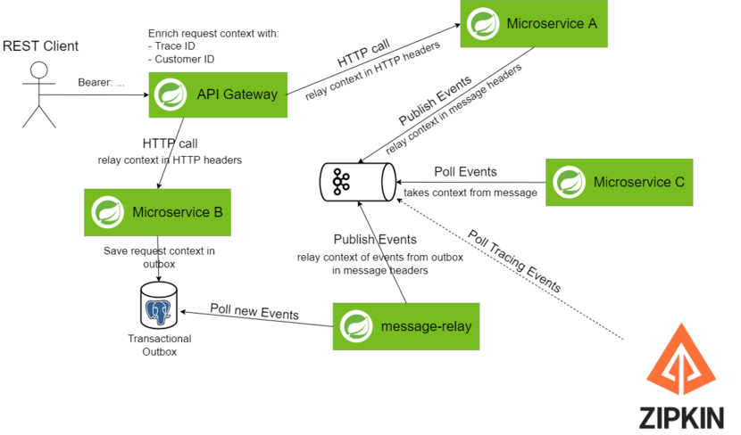
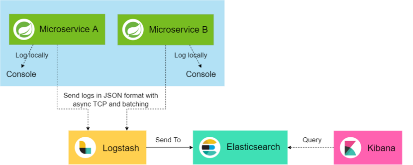
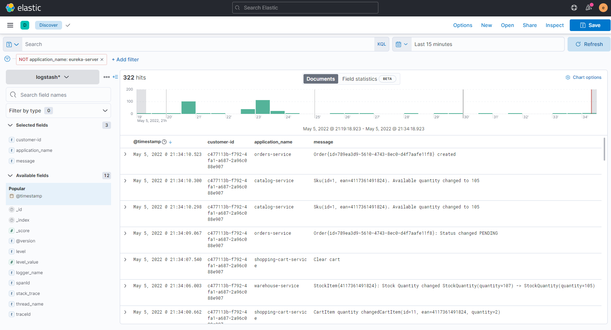
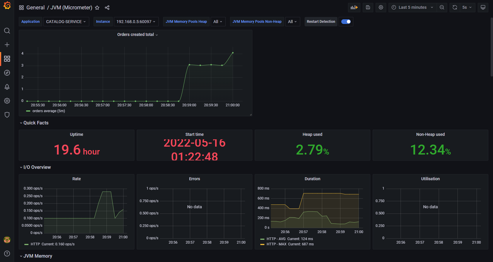

# Observability

## Distributed Tracing (Spring Sleuth + Zipkin)



Для _distributed tracing_ используется ```Spring Sleuth```. 

По всем сервисам с ```API Gateway``` передаются данные о запросе:
* Trace ID
* Customer ID

Дополнительные данные передаются при:
* HTTP-запросах между микросервисами
* Передачи событий в ```Kafka```
* Передачи событий через ```Transactional Outbox```

###### Enable Zipkin

Трейсы передаются в ```Zipkin``` через ```Kafka```.

```Zipkin``` можно запустить через ```docker-compose```

```shell
docker-compose -f docker/monitoring/docker-compose.yml up -d zipkin
```

> ```Zipkin```: [localhost:9411](http://localhost:9411)

## Logs Aggregation (ELK)



> Логи отправляются в ```Logstash``` асинхронно через TCP, поэтому возможно потеря части логов.

Во все логи через ```MDC``` добавляются поля ```Trace ID``` и
```Customer ID```, полученные из [Distributed Tracing](#distributed-tracing-spring-sleuth--zipkin)'а,
и в ```Kibana``` доступна фильтрация и поиск по этим полям.




###### Enable ELK

Для сбора логов в _ELK_ необходимо запускать сервис с профилем
```-Dspring.active.profiles=elk-logs```.

ELK можно запустить через ```docker-compose```

```shell
docker-compose -f docker/elk/docker-compose.yml up -d
```

> ```Kibana```: [localhost:5601](http://localhost:5601)  
_User: elastic_  
_Password: admin_


## Monitoring (Prometheus + Grafana)

_Prometheus_ и _Grafana_ можно запустить через ```docker-compose```

```shell
docker-compose -f docker/monitoring/docker-compose.yml
```

> ```Grafana```: [localhost:3000](http://localhost:3000)  
_User: admin_  
_Password admin_ 


